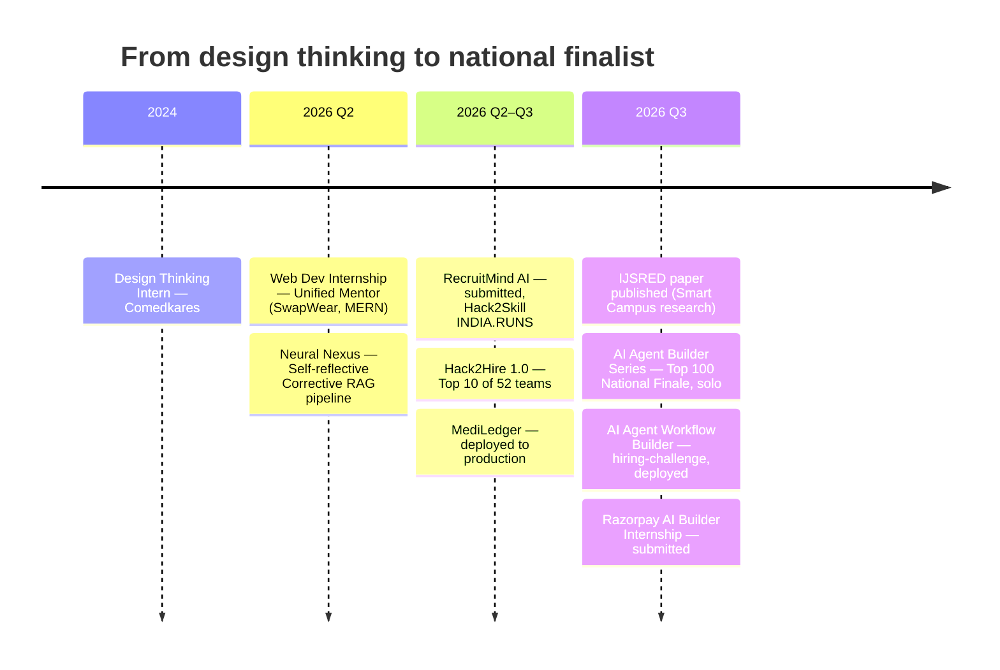
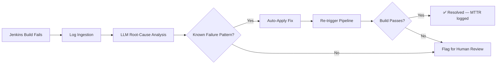
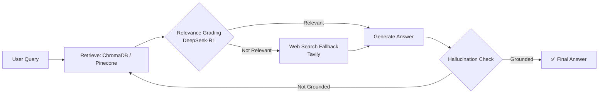

 

> **If you're a recruiter, here's the 10-second version:** I take AI agent ideas from architecture diagram → deployed URL, usually solo, usually fast, and I have the metrics, publication, and national-level hackathon results to prove the work is real — not tutorial-following.

 

## 📊 Snapshot — the numbers first

| Metric | Proof |
|---|---|
| 🏆 **69.8% MTTR reduction** | Self-healing DevOps agent — Hack2Hire 1.0, Top 10 of 52 teams |
| 🎯 **90% classification accuracy** | Same agent, root-cause classification on live Jenkins logs |
| 🥇 **Top 100 nationally** | AI Agent Builder Series 2026 National Finale (HiDevs × AI House) — **solo entrant** |
| 📄 **1 published paper** | IJSRED, Vol. 9 Issue 3 (May–Jun 2026) — ISSN 2581-7175 |
| 🧠 **300+ candidates ranked** | RecruitMind AI — 6-node LangGraph pipeline, 5-signal scoring |
| 🏥 **1 live production system** | MediLedger — GST billing platform, deployed & in real use |
| ⏱️ **9.0 CGPA, 0-day notice** | Final year, immediately available |

 

## 🧭 About me

I'm a final-year Computer Science Engineering student at T. John Institute of Technology, Bengaluru, graduating 2027 — but I've been shipping since 2024. My focus is **agentic AI systems** (LangGraph, RAG, multi-agent pipelines) and **full-stack delivery** (React 19, FastAPI/Django, Docker, real cloud deployments). I don't stop at a Jupyter notebook or a localhost demo — every project below is either deployed, benchmarked against a real metric, submitted to a competitive hackathon, or written up in a published paper.

What makes my track record different: most student portfolios are five clones of a to-do app. Mine includes a self-healing DevOps agent that measurably cut incident resolution time, a recruitment engine that ranks hundreds of real candidates, a GST-compliant billing system running for an actual family business, and a solo Top-100 finish at a national AI agent-building finale against teams.

 

## 🛤️ Builder timeline

 

## 🏆 Hackathons & competitive results

| Event | Result | What I built |
|---|---|---|
| **Hack2Hire 1.0** | 🥉 Top 10 of 52 teams | Self-healing Jenkins DevOps agent, 69.8% MTTR ↓, 90% accuracy |
| **AI Agent Builder Series 2026 — National Finale** (HiDevs × AI House) | 🏅 Top 100 shortlisted, solo, 12-hr in-person finale | Agentic solution built end-to-end in one day |
| **Hack2Skill INDIA.RUNS 2026** | Submitted | RecruitMind AI — agentic recruitment platform |
| **Razorpay AI Builder Internship 2026** (Open Track) | Submitted | Jenkins Pipeline Analyzer agent |
| **Humanity Founders — B2B Textile Marketplace** | Submitted | MERN buyer/supplier marketplace with AI assistant |
| **Ideathon Challenge** | Submitted (2nd entry) | CodeGuard AI |
| **The Great Agent Hackathon** (Women in Product India × Freshworks) | 🔜 Sept 2026 | Registering — bringing the Jenkins agent forward |

 

## 🚀 Featured projects

<b>🩺 AI-Powered Jenkins Pipeline Analyzer & Self-Healing DevOps Agent</b> — the flagship

 

Analyzes Jenkins CI/CD logs, performs LLM-based root-cause analysis, and **autonomously applies fixes** — no human in the loop for known failure classes. **Top 10 of 52 teams at Hack2Hire 1.0.**

`Python` `Gemini LLM` `Flask` `Streamlit` `Jenkins` `CI/CD`

**Impact:** 69.8% reduction in mean-time-to-resolution · 90% failure-classification accuracy · re-used as the submission for both the Razorpay AI Builder Internship and the upcoming Great Agent Hackathon.

[→ View repo](https://github.com/vinaybabannavar-create/AI-Powered-Jenkins-Pipeline-Analyzer-Self-Healing-DevOps-Agent)

<b>🧠 Neural Nexus</b> — self-reflective Corrective RAG

 

A 5-node LangGraph stateful graph that grades its own retrieval, falls back to live web search when context is weak, generates an answer, and **checks itself for hallucination** before returning it — zero human intervention end to end.

`LangGraph` `DeepSeek-R1` `ChromaDB` `Pinecone` `Tavily` `FastAPI`

[→ View repo](https://github.com/vinaybabannavar-create/Neural-Nexus)

<b>🎯 RecruitMind AI</b> — agentic recruitment platform

 

6-node LangGraph pipeline that parses JDs, computes 384-dim embeddings, and ranks **300+ candidates** with a 5-signal composite score plus a diversity re-ranker. 8 async FastAPI endpoints, interactive Streamlit UI. Submitted to Hack2Skill INDIA.RUNS 2026.

`LangGraph` `Groq Llama-3.3-70B` `ChromaDB` `FastAPI` `Docker` `Streamlit`

[→ View repo](https://github.com/vinaybabannavar-create/RecruitMind-AI)

<b>💊 MediLedger</b> — production system for a real business

 

GST-compliant pharmacy billing and inventory management system, built end-to-end for a family-run medical store and **actually deployed** — frontend on Vercel, backend + PostgreSQL on Render. This isn't a hackathon toy; it's software real people use for real transactions.

`FastAPI` `PostgreSQL` `React 19` `Tailwind CSS` `Docker Compose`

<b>🏫 Smart Campus Intelligence System</b> — published research

 

5-module campus AI system spanning attendance, security, energy, health, and navigation via computer vision and ML. Basis for a co-authored, **published paper**: *"Towards a Connected Campus: Design and Evaluation of an AI-Augmented Institutional Management Platform"* — IJSRED, ISSN 2581-7175, Vol. 9 Issue 3, May–Jun 2026.

`MobileNetV2` `XGBoost` `SHAP` `Django` `React.js` `MySQL`

<b>🧵 Other builds</b> — CodeGuard AI · Digital Twin System · AI Traffic Signal · AI Agent Workflow Builder

 

- **AI Agent Workflow Builder** — mini-n8n workflow engine on nhost/Hasura/PostgreSQL/Next.js with role-based permissions, multiple step types, and multiple trigger types. Built for a hiring challenge — submitted and deployed to production.
- **Intelligent Digital Twin System** — syncs real-time IoT sensor data with ML models for predictive-maintenance anomaly detection.
- **Smart AI Traffic Signal System** — OpenCV-based vehicle-density detection that dynamically optimizes signal timing.
- **CodeGuard AI** — second entry submitted to the Ideathon Challenge track.

 

## 🧰 Tech arsenal

| Domain | What I use it for |
|---|---|
| **Agentic AI** | LangGraph multi-node pipelines · LangChain · RAG (corrective + self-reflective) · Groq / DeepSeek-R1 / Gemini APIs |
| **Vector search** | ChromaDB · Pinecone |
| **Backend** | FastAPI · Django · Flask · async REST APIs |
| **Frontend** | React 19 · TypeScript · Tailwind CSS |
| **Data** | PostgreSQL · MongoDB · MySQL |
| **DevOps** | Docker · Docker Compose · Jenkins · CI/CD · GitHub Actions-style pipelines |
| **Cloud** | Microsoft Azure · Vercel · Render |

 

## 🎓 Certifications

| Certification | Issuer |
|---|---|
| Azure AI Fundamentals (AI-900) | Microsoft |
| Azure Fundamentals (AZ-900) | Microsoft |
| GenAI Powered Data Analytics Job Simulation | TATA Forage |
| Networking Basics | Cisco |
| Cloud Computing · DBMS · Intro to Machine Learning | NPTEL |
| Generative AI Mastermind | Outskill |
| Innovation & Design Thinking Program | Comedkares |

 

## 🔭 Currently building

- 🔜 Preparing the Jenkins self-healing agent for **The Great Agent Hackathon** (Women in Product India × Freshworks), Sept 2026
- 🏗️ **Phase 2 of Smart Campus Intelligence System** — an AI project-tracker/repo-review agent + JD-based resume matching platform for placement drives
- ✨ **AI Career Copilot** — a SaaS app for resume/JD analysis with a dashboard and history tracking

 

## 📈 GitHub stats

 

## 🤝 Why work with me

1. **I finish and ship.** Every project above has a live URL, a benchmark, a hackathon result, or a publication — not just a repo that stopped at "works on my machine."
2. **I go solo when I have to.** Top 100 nationally in a 12-hour finale, competing solo against 2-person teams.
3. **I build for real stakeholders.** MediLedger runs for an actual small business, not a grading rubric.

**📬 Open to fresher-level internships and full-time SWE roles in AI/ML & full-stack — available immediately.**

